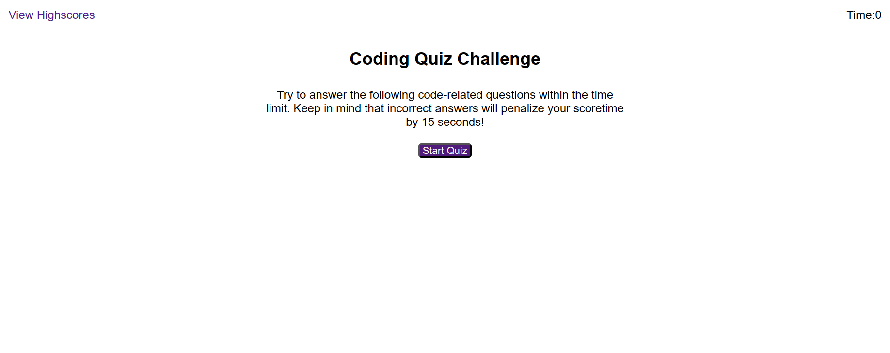

# JavaScript Code Quiz

## Table of Contents

- [Description](#description)
- [Code Languages](#code-languages)
- [Installation](#installation)
- [Usage](#usage)

## Description

The purpose of this project is to build a timed JavaScript coding quiz with multiple-choice questions. This app will run in the browser and will feature dynamically updated HTML and CSS powered by JavaScript code. It will have a clean, polished, and responsive user interface that stores high scores. Players can gauge their progress compared to other players.

## Code Languages

- HTML
- CSS
- JavaScript

## Installation

- Not required.
- You can view the screenshot or live website in the Usage section, below.

## Usage

To play the game,
- Visit the website at (https://skhai77.github.io/js-code-quiz)
- Click the start button
- Then the timer will start and you will see a question
- Then answer the question by typing your prediction
- Then you will see another question
- When you answer a question incorrectly the time will be subtracted from the clock
- After all questions are answered or the timer reaches 0
- Then the game is over
- Then, you can save your initials and your score

Preview the homepage:

